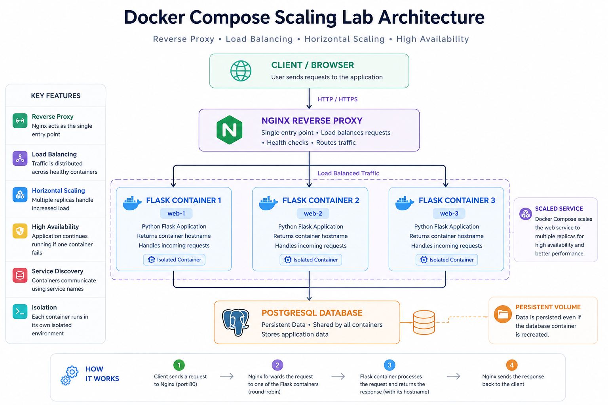
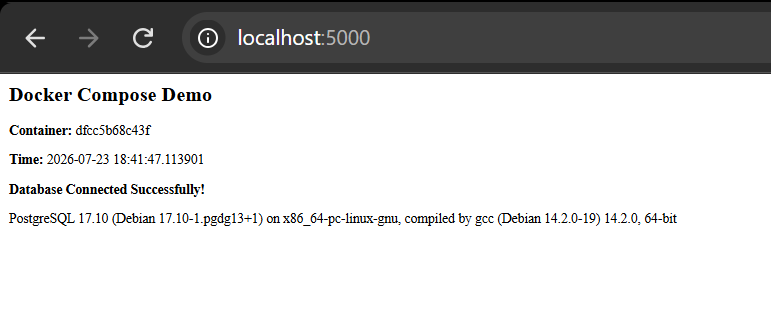
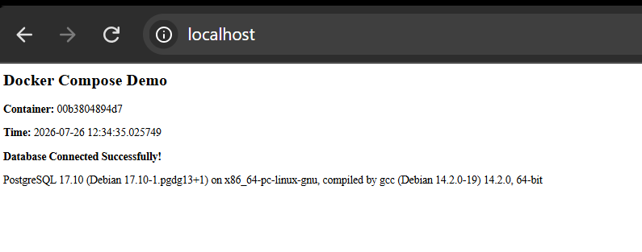
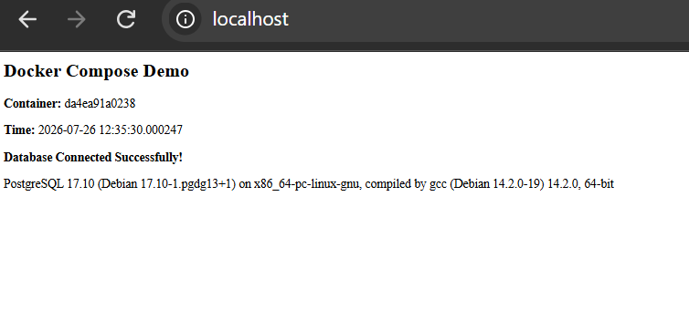
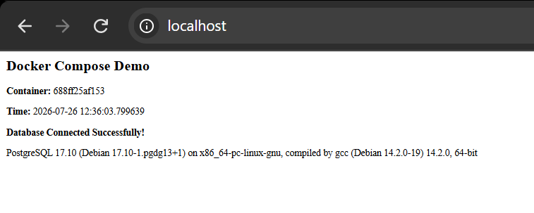

<div align="center">

# 🚀 Docker Compose Scaling Lab

**Understanding Horizontal Scaling, Reverse Proxies, and High Availability Through Experimentation**

<br>


<br>



</div>

<br>

---

<br>

## 📌 Why This Experiment Was Built

This project wasn't created to learn Flask or memorize Docker commands. It was built to answer a practical engineering question:

> **What actually happens when a service is scaled with Docker Compose?**

I understood the theory behind horizontal scaling, but I wanted to observe how traffic was distributed across multiple application containers, understand where a reverse proxy fits into the architecture, and see what happens when one of those containers fails. 

Instead of relying on another tutorial, I built a small experiment to answer those questions.

<br>

## ⚠️ Problem Statement

Horizontal scaling is one of the most commonly discussed concepts in modern software engineering. Documentation often explains that an application can be scaled from one container to many, but it rarely demonstrates:
* How requests are actually distributed.
* How reverse proxies fit into the architecture.
* How applications continue serving traffic when one instance becomes unavailable.

Without seeing these behaviours in practice, concepts such as load balancing, service discovery, and high availability remain theoretical. This project bridges that gap by creating a small but realistic environment where these behaviours can be observed directly.

<br>

## 🔬 The Engineering Question

The project started with a simple question:

> **"If I scale a web application from one container to multiple containers, how are incoming requests actually distributed?"**

That question naturally led to several others:
1. Does Docker Compose perform load balancing?
2. Why is Nginx commonly placed in front of application containers?
3. What role does Docker's internal networking play?
4. What happens when one application container becomes unavailable?

Instead of searching for theoretical explanations, this project was built to answer those questions experimentally.

<br>

## 🎯 Objectives

This project was designed to:
- [x] Containerize a web application.
- [x] Connect multiple services using Docker Compose.
- [x] Understand Docker networking and service discovery.
- [x] Introduce Nginx as a reverse proxy.
- [x] Scale an application horizontally.
- [x] Observe request distribution across replicas.
- [x] Demonstrate basic fault tolerance by intentionally stopping a running container.
- [x] Bridge the gap between theoretical knowledge and real-world behaviour.

<br>

---

<br>

## 🏗️ Architecture

The architecture routes all external internet traffic through an Nginx reverse proxy. Nginx acts as the single entry point and distributes incoming requests across three isolated Flask application containers. These application containers communicate over a private Docker network to a single, shared PostgreSQL database volume.

<br>

### Technology Stack

| Technology | Purpose |
| :--- | :--- |
| **Docker** | Package the application into portable containers |
| **Docker Compose** | Define and orchestrate the multi-container environment |
| **Flask** | Lightweight web application used for the experiment |
| **PostgreSQL** | Demonstrate communication between independent containers |
| **Nginx** | Reverse proxy responsible for forwarding requests |
| **Python** | Backend language |

<br>

### Project Structure

```bash
docker-scaling-project/
├── docker-compose.yml
├── nginx.conf
├── README.md
├── architecture.png
└── app/
    ├── app.py
    ├── requirements.txt
    └── Dockerfile
```

<br>

---

<br>

## 🚀 Implementation Journey

The environment was built iteratively to understand the purpose of each component:

* **Stage 1 | Single Container** <br> Containerizing the base Flask application to ensure the Python runtime and dependencies were packaged correctly.
* **Stage 2 | Database Integration** <br> Introducing PostgreSQL and verifying database connections via environment variables.

  
  
* **Stage 3 | Docker Compose** <br> Transitioning from manual `docker run` commands to a declarative `docker-compose.yml` file to manage both services simultaneously.
* **Stage 4 | Reverse Proxy** <br> Adding Nginx to the network to act as a traffic director in front of the application layer.
* **Stage 5 | Scaling** <br> Utilizing Docker Compose to scale the Flask application to multiple replicas and configuring Nginx to route to the upstream pool.

<p align="center">



</p>


* **Stage 6 | Failure Simulation** <br> Intentionally killing active containers during request cycles to observe system resilience.

<br>

---

<br>

## 📊 Experimental Results (Key Findings)

* **Observation 1:** Docker Compose automatically created an isolated network, allowing services to communicate using service names rather than IP addresses.
* **Observation 2:** Each application replica remained completely isolated despite originating from the same Docker image.
* **Observation 3:** Displaying the container hostname in each response provided visual confirmation that requests were reaching different replicas.
* **Observation 4:** Stopping one application replica did not interrupt service because Nginx continued routing requests to the remaining healthy containers.
* **Observation 5:** Docker Compose does not automatically recreate failed replicas, highlighting a key difference between Compose and orchestration platforms such as Docker Swarm or Kubernetes.

<br>

## 🧠 Lessons Learned

* The difference between images and containers became much clearer after scaling a single image into multiple running instances.
* Reverse proxies simplify client communication by acting as the single public entry point to backend services.
* Docker networking eliminates the need for manual IP management through built-in DNS-based service discovery.
* Horizontal scaling improves application availability but does not replace the need for true orchestration.

<br>

## 🔮 Future Work

This project serves as a foundation for a highly available, observable, production-ready containerized web platform. The next phases of development will include:

1. Replace Flask's development server with **Gunicorn**.
2. Add container **health checks**.
3. Introduce **Prometheus** and **Grafana** for observability.
4. Automate builds and tests with **GitHub Actions**.
5. Compare Docker Compose with **Docker Swarm** and **Kubernetes** deployments.

<br>

---
*Authored by Ganiu Kuku*
